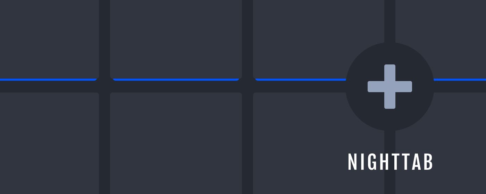
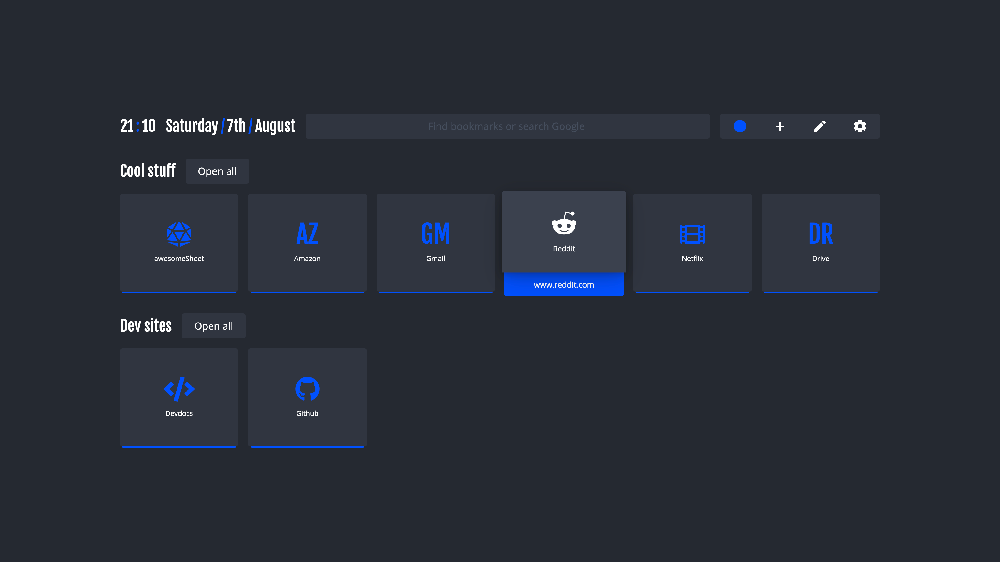
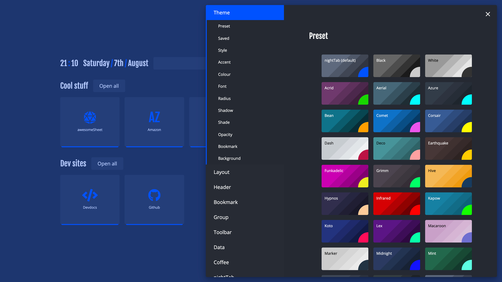
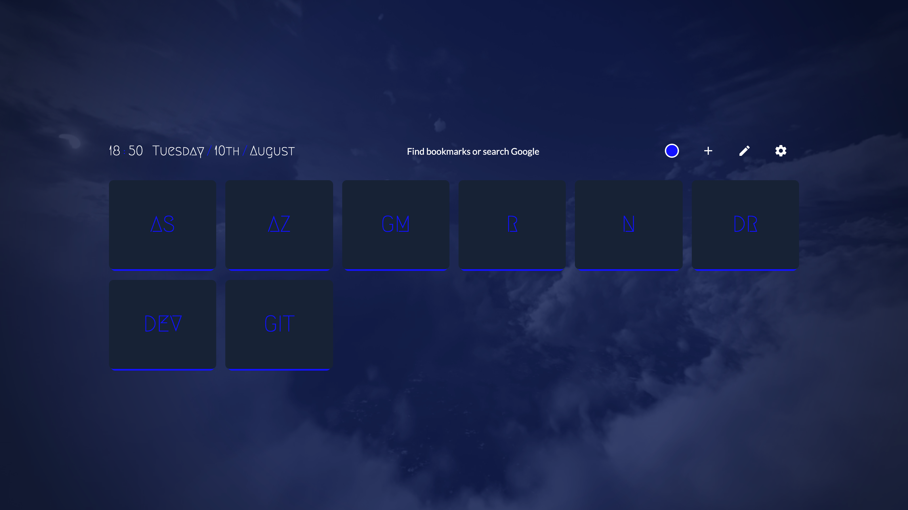
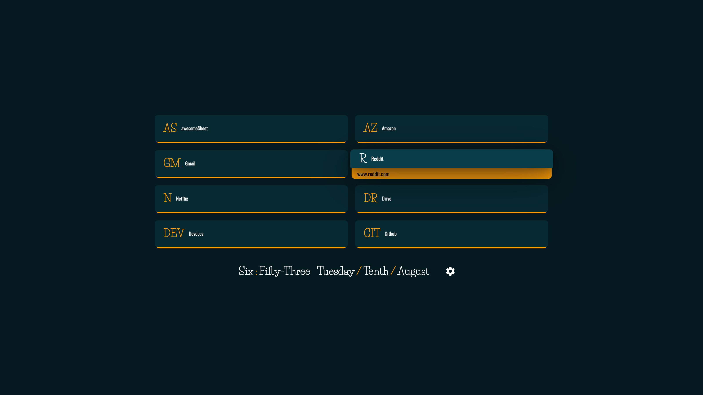
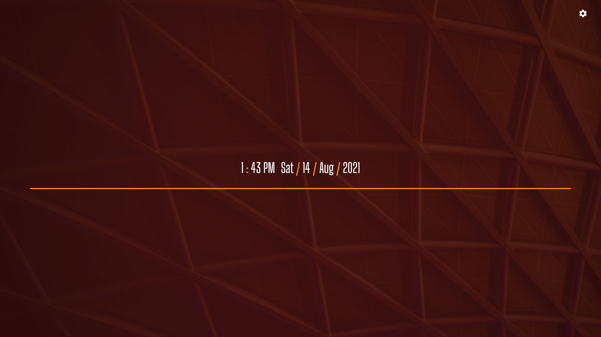
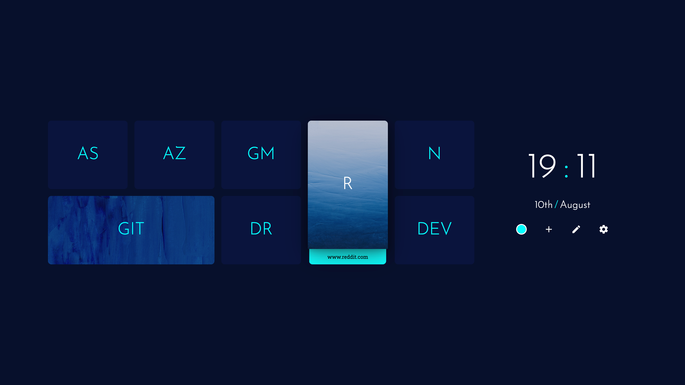
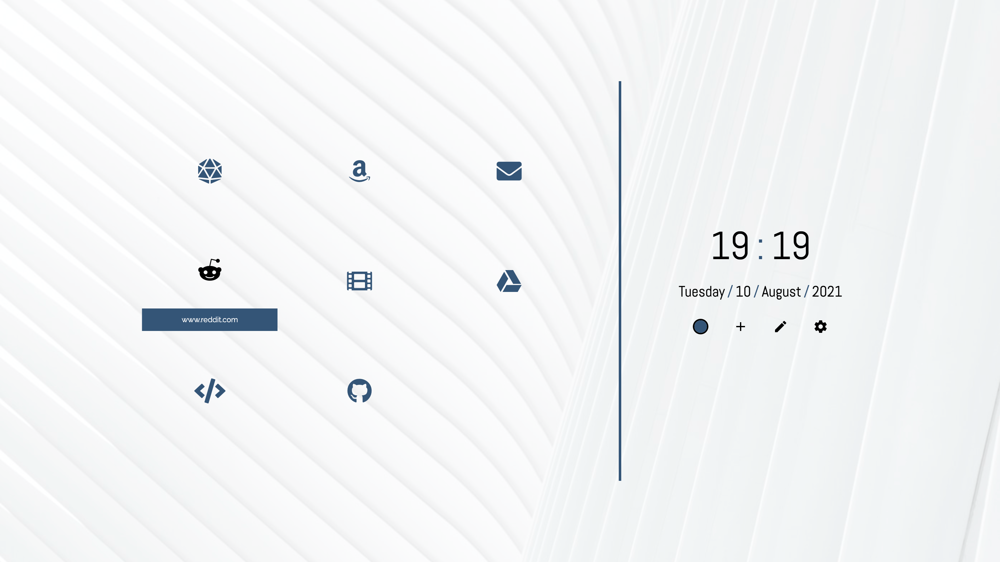
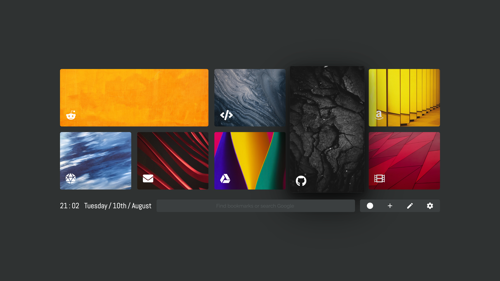

# 

A neutral new tab page accented with a chosen colour. Customise the layout, style, background and bookmarks in nightTab -- a custom start page.

| [See the demo in action](https://sahilkumardhala.github.io/nightTab/) | [Install nightTab Extension](https://chrome.google.com/webstore/detail/nighttab/hdpcadigjkbcpnlcpbcohpafiaefanki) | [Install nightTab Add On](https://addons.mozilla.org/en-GB/firefox/addon/nighttab/) | [Buy me a coffee](https://www.buymeacoffee.com/sahilkumardhala/) | [Join the community](https://www.reddit.com/r/nighttab/) |
|:-------------:|:-------------:|:-------------:|:-------------:|:-------------:|
|  |  |
# Support

- [Project goals](#)

# Development

When developing use:
- `npm start`

A development server will automatically open the project in your browser. Normally here: `http://localhost:8080`.

To build the project use:
- `npm run build`

A web ready folder will be created in `/dist/web/`.
A browser addon/extension ready zip will be created in `/dist/extension/`.

# Screenshots

## Example nightTab setups:

- [Where to find these setups](https://github.com/sahilkumardhala/nightTab/tree/main/asset/screenshot)
- [How to import these setups]()

